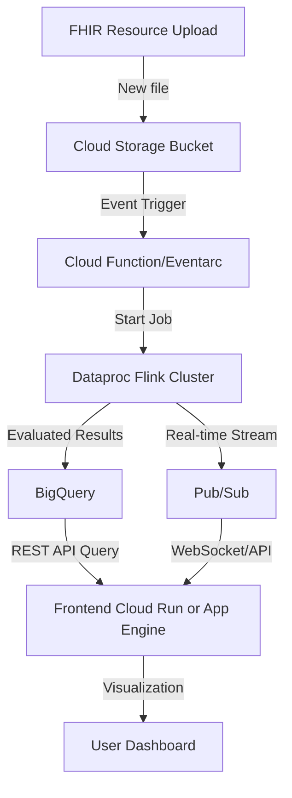
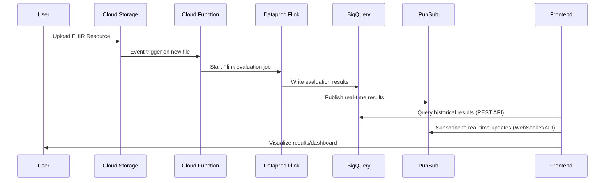
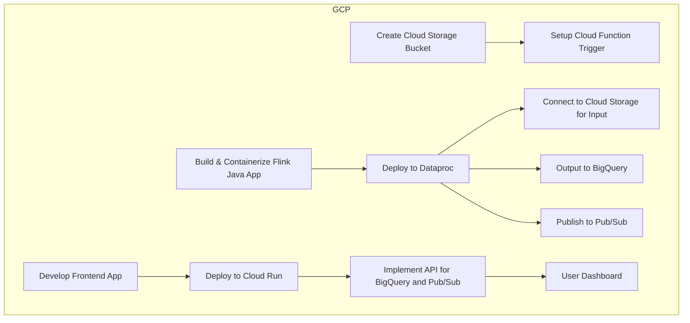

# cql-fhir-flink
CQL evaluator configured as an Apache Flink task to continuously evaluate incoming FHIR patient resources in an input directory.

Change directory paths appropriately in `Application.java`.

## Steps

1. Copy relevant valueset files in the `valuesets` directory.
2. Copy measure CQL definitions in the `cql` directory.
3. Start the application by running `Application.java`.
4. Place patient FHIR JSON formatted files in the `input` directory.

**TODO:** Make measurement period a variable to the application.

# Currently under Development: GCP Deployment Design for CQL-FHIR-Flink

## High-Level Architecture

---

## Data Flow Sequence

---

## Deployment Steps Overview

---

## GCP Services Overview

| Function            | GCP Service                              |
|---------------------|------------------------------------------|
| File Storage        | Cloud Storage                            |
| Event Trigger       | Cloud Function/Eventarc                  |
| Stream Processing   | Dataproc (Flink)                         |
| Result Storage      | BigQuery                                 |
| Real-Time Streaming | Pub/Sub                                  |
| Frontend Hosting    | Cloud Run / App Engine                   |
| Authentication      | Identity Platform / Firebase Auth        |
| Monitoring          | Cloud Monitoring / Logging               |

---

## Frontend Visualization Features

- Real-time dashboard for CQL evaluation results per patient (WebSocket for live updates)
- Historical analytics/search (REST API to backend querying BigQuery)
- Alerts and notifications for critical evaluations
- Authentication for secure access

---
